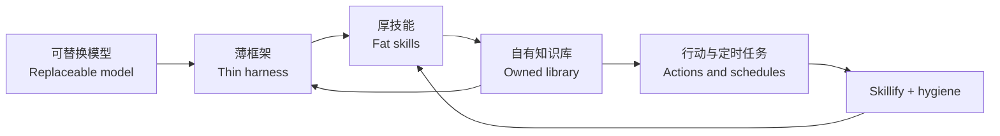

# 掌握自己的力量 / Under Your Own Power

> [!abstract] 60 秒摘要 / 60-second brief
> Garry Tan 所说的 personal AGI，不是等待一个万能模型，而是把可替换的模型、你拥有的知识库、可执行的技能文件和工具层组合成一个由你控制的个人系统。
>
> Garry Tan's personal AGI is not a universal model to wait for. It is a user-controlled system made from replaceable models, an owned knowledge library, executable skill files, and a tool layer.

![[dashboard.html]]

## 核心判断 / Core thesis

### 中文

1. **模型可替换，积累不可替换。** 长期差异来自你拥有的上下文、历史与流程，而不是某一代模型。
2. **技能是外部化的判断。** 一旦经验被写成可执行文件，所有权就成为治理问题。
3. **知识库需要卫生机制。** 来源、冲突检查、置信度和修剪，比单纯扩大检索规模更重要。
4. **从一格书架开始。** 先用一个小 Markdown 文件夹解决真实问题，再逐步扩展。
5. **每次成功都要 skillify。** 重复请求应触发流程固化，而不是重新从零对话。

### English

1. **Models are replaceable; accumulation is not.** Durable differentiation comes from context, history, and procedures you own.
2. **A skill externalizes judgment.** Once experience becomes executable, ownership becomes a governance issue.
3. **A library needs hygiene.** Provenance, conflict checks, confidence, and pruning matter more than indiscriminate scale.
4. **Begin with one small shelf.** Solve a real problem with a small Markdown folder before expanding.
5. **Skillify every successful repeat.** Repeated requests should trigger procedural capture, not another cold start.

## 系统图 / System map



| 层 / Layer | 角色 / Role | 本次映射 / Mapping |
|---|---|---|
| Model | 推理引擎，可替换 / Replaceable reasoning engine | 任意可用模型 / Any capable model |
| Harness | 路由、工具与执行 / Routing, tools, execution | Hermes Agent, OpenClaw, Codex, Claude Code |
| Skills | 清晰、可复用的操作说明 / Clear reusable procedures | `SKILL.md` + scripts + checks |
| Library | 你拥有的历史与实体页 / Owned history and entity pages | Markdown + Obsidian |
| Loop | 复用、定时、纠错、修剪 / Reuse, schedules, correction, pruning | cron + skillify + evidence hygiene |

## 金句 / Golden lines

仅一条英文在合并自动字幕片段并规范化空白后精确匹配；其余为编辑转述。翻译不是官方字幕。

Only one English line below exactly matches the merged auto-captions after whitespace normalization. The rest are editorial paraphrases; translations are not official captions.

> [!quote] 原话 / Verbatim — [16:56](https://www.youtube.com/watch?v=eRrc1pUY5oU&t=1016s)
> 逐字英文仅保留在同目录 `dashboard.html` 的金句卡中，避免在交付物间重复转载。
>
> **译文 / Translation:** Markdown，不是魔法；厚技能，薄框架。
> **为什么重要 / Why it matters:** 把持久价值放进可携带的技能与数据，而不是某个代理壳。

^quote-fat-skills

> [!quote] 转述 / Paraphrase — [32:50](https://www.youtube.com/watch?v=eRrc1pUY5oU&t=1970s)
> 在代理时代，个人 AGI 的意义是让认知能力、知识与技能仍由你自己控制。
>
> **English:** In an agentic age, personal AGI matters because your cognition, knowledge, and skills remain under your control.
> **为什么重要 / Why it matters:** 这把技术架构提升为所有权与自主性问题。

^quote-own-power

### 高信号转述 / High-signal paraphrases

| 时间 / Time | 中文 | English | 类型 / Type |
|---|---|---|---|
| [14:13](https://www.youtube.com/watch?v=eRrc1pUY5oU&t=853s) | 你的经历本质上是一座需要管理员的图书馆。 | Your accumulated history is a library-sized corpus that needs a librarian. | PARAPHRASE |
| [17:10](https://www.youtube.com/watch?v=eRrc1pUY5oU&t=1030s) | 清晰技能应抽取承诺、责任人和期限，再把每位人物链接到知识库。 | A clear skill extracts commitments, owners, and deadlines, then links every named person to the library. | PARAPHRASE |
| [20:39](https://www.youtube.com/watch?v=eRrc1pUY5oU&t=1239s) | 深度研究只有变成可反复调用的个人流程后才开始复利。 | Deep research compounds after it becomes a reusable personal procedure. | PARAPHRASE |
| [23:37](https://www.youtube.com/watch?v=eRrc1pUY5oU&t=1417s) | 没有来源、冲突检查与修剪，检索会更自信地复述旧错。 | Without provenance, conflict checks, and pruning, retrieval can confidently repeat stale errors. | PARAPHRASE |
| [27:51](https://www.youtube.com/watch?v=eRrc1pUY5oU&t=1671s) | 同一请求出现第二次，说明第一次成果还没有被固化。 | When a request repeats, the prior solution has not yet been captured as reusable procedure. | PARAPHRASE |
| [34:05](https://www.youtube.com/watch?v=eRrc1pUY5oU&t=2045s) | 更好的模型会放大自有知识库的价值，而不是取代它。 | Better models amplify the value of owned context rather than replace it. | PARAPHRASE |

## Patrick Lens / 个人关联层

> [!warning] 证据边界 / Evidence boundary
> 完整英文自动字幕中，`Patrick`、`Patrik`、`Patric` 直接提及均为 0。本节是对 Patrick 磁盘上 Hermes 资产的个人映射，不代表视频说法，也不写成“Patrick 认为”。
>
> `Patrick`, `Patrik`, and `Patric` have zero direct mentions in the full English auto-captions. This section maps the talk onto Patrick's on-disk Hermes assets; it is not a claim made by the video.

| 状态 / Status | 视频原则 → Patrick 资产 / Video principle → Patrick asset | 关系与限制 / Relation and limit |
|---|---|---|
| APPLIED | 重复工作应固化 → `~/.hermes/skills/autonomous-ai-agents/skillify/SKILL.md` | 完全同源；文件存在。本次未新建或修改 skill。 |
| LIVE ON DISK | 知识库 + OODA 执行闭环 → `~/.hermes/skills/patricks-vault-os/SKILL.md` | 同源；五个支持工具目录存在。本次未执行其运行时。 |
| LIVE VAULT | 自有 Markdown 知识库 → `~/.hermes/skills/note-taking/obsidian/SKILL.md` | 同源；活动 Vault 已核验存在。本次没有写入 Vault。 |
| APPLIED | 金句 + Patrick 映射 + 行动 → `~/.hermes/skills/media/video-patrick-action-lens/SKILL.md` | 完全同源；本页按其证据分类和行动卡规范生成。 |
| GUARDRAIL | 来源与运行结果不可伪造 → `~/.hermes/skills/agent-trace-integrity/SKILL.md` | 同源警示；能守证据边界，不等于自动完成知识修剪。 |
| REFERENCE | L1 文本、L2 图检索、L3 认识论 → `~/.hermes/skills/autonomous-ai-agents/memory-three-layer/SKILL.md` | 部分同源；设计存在，未证明闭环卫生机制正在运行。 |
| SUPPORTING | 双语 HTML + TOC → `html-redesign-preserve-semantics` + `toc-sidebar-batch` | 仅交付层同源；它改善阅读，不是个人 AGI 的核心记忆机制。 |

### 推荐五技能栈 / Recommended five-skill stack

```text
/video-to-knowledge-dashboard /video-patrick-action-lens /obsidian /html-redesign-preserve-semantics /toc-sidebar-batch <YouTube URL>
```

## 下一步行动 / Next actions

行动不是总结：它需要一个动词、可观察的完成标准、证据、护栏和停止条件。

An action is not a takeaway. It needs a verb, an observable done state, evidence, a guardrail, and a stop condition.

### P0 — 今天 / Today

- [ ] **建立 Personal AGI ownership policy** — Owner: Patrick · 20 min
  - 5 分钟微步 / 5-minute micro-step:: 新建文件，只写 `Owner / Repo / Keys / Export / Delete / Secrets / Review` 七个标题。
  - Artifact:: `active/personal-agi-2026-08/README.md`
  - Done when:: 明确知识库、技能、密钥、导出与删除权分别归谁，并写出禁止进入系统的数据。
  - Evidence:: 文件存在；下一次新工具评审能用这七项做准入判断。
  - Guardrail:: 不写入密钥、令牌、个人敏感内容。
  - Stop / rollback:: 若 30 天没有任何决策引用它，移入 `active/_archive/`。
  - Source:: [32:50](https://www.youtube.com/watch?v=eRrc1pUY5oU&t=1970s)

- [ ] **把本次流程固化为可复跑的 skillify 回归案例** — Owner: Patrick · 30 min
  - 5 分钟微步 / 5-minute micro-step:: 先写五个验收标题：`Transcript / Quotes / Patrick / Actions / HTML+MD`。
  - Artifact:: `~/.hermes/skills/media/video-to-knowledge-dashboard/references/garry-tan-personal-agi-2026-08-07.md`
  - Done when:: 对第二个视频复跑时，五类输出全部生成且无需重新解释格式。
  - Evidence:: 一次干跑记录；引用、内部链接、JS 与中英文完整性检查通过；移动端断点完成静态检查。
  - Guardrail:: 不自动发布、不自动写活动 Vault、不把编辑转述标成原话。
  - Stop / rollback:: 第二次运行若没有减少返工，删除该案例并保留问题清单。
  - Source:: [27:51](https://www.youtube.com/watch?v=eRrc1pUY5oU&t=1671s)

### P1 — 本周 / This week

- [ ] **定义知识卫生 schema 与冲突队列** — Owner: Patrick · 60 min
  - Artifact:: `active/personal-agi-2026-08/knowledge-schema.md`
  - Done when:: 新事实包含 `source_class`, `source_url`, `captured_at`, `confidence`, `status`, `reviewed_at`, `conflicts_with`；冲突进入人工队列。
  - Evidence:: 用 10 条真实笔记做 schema 走查，10/10 可追溯。
  - Guardrail:: 先覆盖新笔记，不一次性回填整个 Vault。
  - Stop / rollback:: 若每条记录增加超过 60 秒摩擦，缩减为四个必填字段。
  - Source:: [23:37](https://www.youtube.com/watch?v=eRrc1pUY5oU&t=1417s)

- [ ] **建立人物实体链接规则** — Owner: Patrick · 45 min
  - Artifact:: 现有 People 页面 + `person-linking-rule.md`；创建前先查重。
  - Done when:: Garry Tan、Spinoza、Patrick 等名字都解析到唯一人物页；同名冲突必须提示，不静默合并。
  - Evidence:: 用本视频和一份会议记录测试，人物、承诺、责任人、期限均可回链。
  - Guardrail:: 不根据名字猜身份；证据不足标 `Needs review`。
  - Stop / rollback:: 实体误合并率超过 5% 时关闭自动写入，只保留候选建议。
  - Source:: [17:10](https://www.youtube.com/watch?v=eRrc1pUY5oU&t=1030s)

- [ ] **只设计、暂不注册两个定时任务** — Owner: Patrick · 40 min
  - Artifact:: `jobs/morning-briefing.md` + `jobs/friday-skill-review.md`
  - Done when:: 07:00 briefing 与周五 skill review 各完成两次手动干跑，再决定是否注册。
  - Evidence:: 两份输出对实际决策有用；每份都链接来源与待办。
  - Guardrail:: 不自动发邮件、不自动发布、不读取未授权敏感源。
  - Stop / rollback:: 连续两次无人阅读即停用。
  - Source:: [26:42](https://www.youtube.com/watch?v=eRrc1pUY5oU&t=1602s)

### P2 — 90 天 / 90 days

- [ ] **维护个人 AGI 复利记分卡** — Owner: Patrick · 15 min/week
  - Artifact:: `active/personal-agi-2026-08/scorecard.md`
  - Done when:: 在 W1 / W4 / W12 记录 skill 复用次数、纠错次数、冲突提醒、节省时间和停用流程。
  - Evidence:: 至少四周数据支持继续、修改或删除某项自动化的明确决定。
  - Guardrail:: 只记录能改变决策的指标。
  - Stop / rollback:: 维护成本超过每周 15 分钟且四周未改变决策时删除记分卡。
  - Source:: [28:09](https://www.youtube.com/watch?v=eRrc1pUY5oU&t=1689s)

## 编辑时间轴 / Editorial timeline

| 时间 / Time | 中文 | English |
|---|---|---|
| [01:21](https://www.youtube.com/watch?v=eRrc1pUY5oU&t=81s) | Spinoza、逐出与行动能力 | Spinoza, expulsion, and agency |
| [05:45](https://www.youtube.com/watch?v=eRrc1pUY5oU&t=345s) | 个人 AGI 已经像基础设施一样出现 | Personal AGI appears as infrastructure |
| [08:00](https://www.youtube.com/watch?v=eRrc1pUY5oU&t=480s) | 一个人的杠杆为何改变 | Why one person's leverage changed |
| [12:46](https://www.youtube.com/watch?v=eRrc1pUY5oU&t=766s) | 七项工作记忆与千页上下文 | Seven-item working memory vs thousand-page context |
| [14:48](https://www.youtube.com/watch?v=eRrc1pUY5oU&t=888s) | GBrain：知识库与管理员 | GBrain: library plus librarian |
| [16:48](https://www.youtube.com/watch?v=eRrc1pUY5oU&t=1008s) | 技能文件与浏览器工具 | Skill files and browser tools |
| [18:20](https://www.youtube.com/watch?v=eRrc1pUY5oU&t=1100s) | 潜空间判断与确定性计算 | Latent judgment vs deterministic computation |
| [20:00](https://www.youtube.com/watch?v=eRrc1pUY5oU&t=1200s) | 三本传记变成舞台叙事 | Three biographies become a stage narrative |
| [21:25](https://www.youtube.com/watch?v=eRrc1pUY5oU&t=1285s) | 一人公司的技能组织图 | The skill org chart of a company of one |
| [23:36](https://www.youtube.com/watch?v=eRrc1pUY5oU&t=1416s) | 没有卫生机制的知识库风险 | The risk of a library without hygiene |
| [24:23](https://www.youtube.com/watch?v=eRrc1pUY5oU&t=1463s) | 五步搭建自己的系统 | Five steps to build your system |
| [27:29](https://www.youtube.com/watch?v=eRrc1pUY5oU&t=1649s) | Skillify 与 90 天飞轮 | Skillify and the 90-day flywheel |
| [29:34](https://www.youtube.com/watch?v=eRrc1pUY5oU&t=1774s) | 技能所有权成为政治问题 | Skill ownership becomes a political issue |
| [33:36](https://www.youtube.com/watch?v=eRrc1pUY5oU&t=2016s) | 三个反对意见：模型、RAG、隐私 | Three objections: models, RAG, privacy |
| [35:35](https://www.youtube.com/watch?v=eRrc1pUY5oU&t=2135s) | 开源与力量分配 | Open source and the distribution of leverage |
| [38:27](https://www.youtube.com/watch?v=eRrc1pUY5oU&t=2307s) | 父亲、笔记本与八万页资料 | A father, a laptop, and a vast corpus |
| [40:18](https://www.youtube.com/watch?v=eRrc1pUY5oU&t=2418s) | 从许可等待转向直接行动 | From waiting for permission to direct action |

## 证据账本 / Evidence ledger

| 结论 / Claim | 类型 / Type | 证据 / Evidence |
|---|---|---|
| 标题、频道、日期、时长 | SOURCE | YouTube public metadata, retrieved 2026-08-07 |
| 一条英文金句 | VERBATIM | Normalized English JSON3 auto-captions + timestamp deep link |
| 七条高信号线 | PARAPHRASE | Editorial compression of caption passages |
| Patrick 直接提及为 0 | SOURCE SCAN | Case-insensitive scan for `Patrick`, `Patrik`, `Patric` |
| Patrick skill 映射 | PATRICK LENS | Read-only on-disk path and semantic inspection |
| 六个行动 | ACTION | Proposed work; none claimed executed |

### 限制 / Limitations

- 英文字幕为自动生成，专有名词可能误识别；本页对 Spinoza、Karpathy、Codex 等按上下文校正。
- 中文是编辑翻译；时间轴是编辑整理，不是官方章节。
- 未向活动 Obsidian Vault 写入文件，未注册定时任务，未发布网页，未修改任何 Hermes skill。
- 本地路径只证明资产存在；除本页生成流程外，没有把“在磁盘上”升级成“本次运行成功”。

- English captions are auto-generated and can misrecognize names; contextual corrections were made for names such as Spinoza, Karpathy, and Codex.
- Chinese text is editorial translation; the timeline is editorial, not an official chapter list.
- No active-vault writes, schedules, publication, or Hermes skill edits were performed.
- On-disk existence is not treated as runtime proof, except for this artifact's own generation and checks.

## 来源 / Sources

- [Y Combinator video](https://www.youtube.com/watch?v=eRrc1pUY5oU)
- [Hermes Agent official skills documentation](https://github.com/NousResearch/hermes-agent/blob/main/website/docs/user-guide/features/skills.md)

---

Prepared 2026-08-07 · Asia/Shanghai · local-first · no vault writes · no publish
